- [Livrables](#livrables)

- [Échéance](#%c3%89ch%c3%a9ance)

- [Quelques éléments à considérer](#quelques-%c3%a9l%c3%a9ments-%c3%a0-consid%c3%a9rer-pour-les-parties-2-et-3)

- [Travail à réaliser](#travail-%c3%a0-r%c3%a9aliser)

# Sécurité des réseaux sans fil

## Laboratoire 802.11 Sécurité WPA Entreprise

__A faire en équipes de deux personnes__

### Objectif :

1.	Analyser les étapes d’une connexion WPA Entreprise avec une capture Wireshark

## Travail à réaliser

### 1. Analyse d’une authentification WPA Entreprise

Dans cette première partie, vous allez analyser [une connexion WPA Entreprise](files/auth.pcap) avec Wireshark et fournir des captures d’écran indiquant dans chaque capture les données demandées.

- Comparer [la capture](files/auth.pcap) au processus d’authentification donné en théorie (n’oubliez pas les captures d'écran pour illustrer vos comparaisons !). En particulier, identifier les étapes suivantes :
	
	- Requête et réponse d’authentification système ouvert
	
	  **Requête d'authentification**
	
	  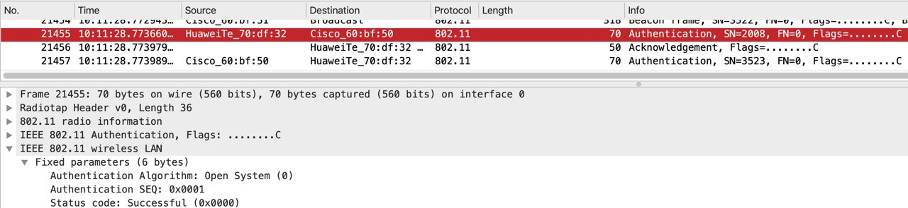
	
	  **Réponse d'authentification**
	
	  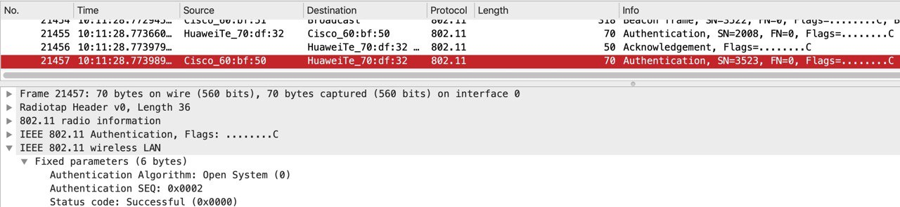
	
	  
	
	- Requête et réponse d’association (ou reassociation)
	
	  **Requête de réassociation**
	
	  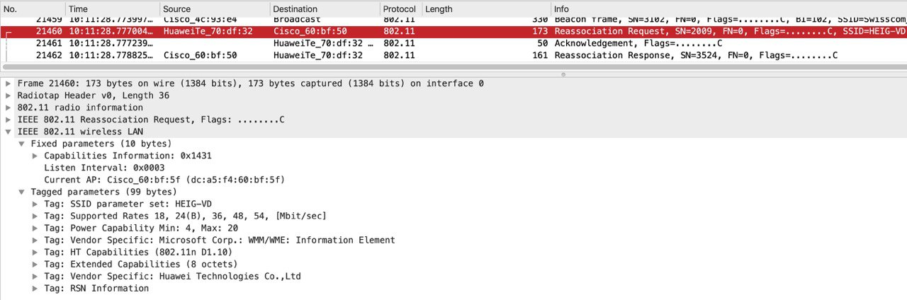
	
	  **Réponse de réassociation**
	
	  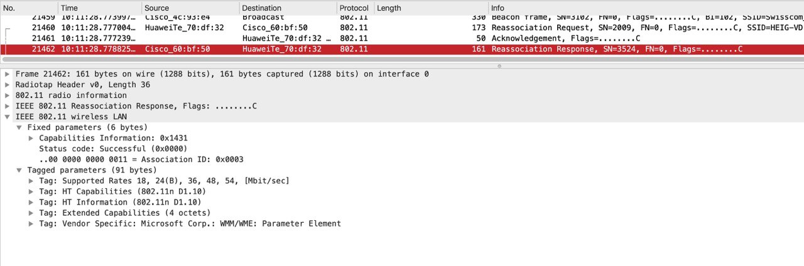
	
	- Négociation de la méthode d’authentification entreprise
	
	  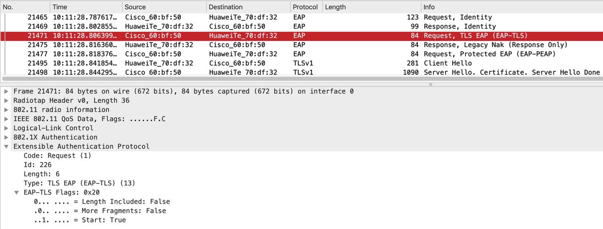
	
	  
	
	  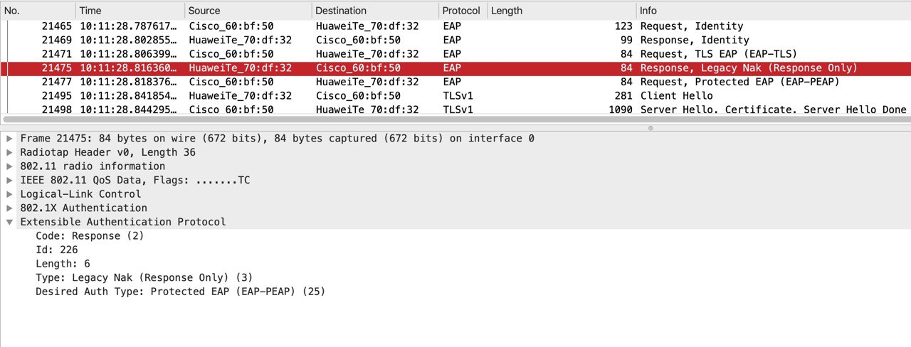
	
	  
	
	  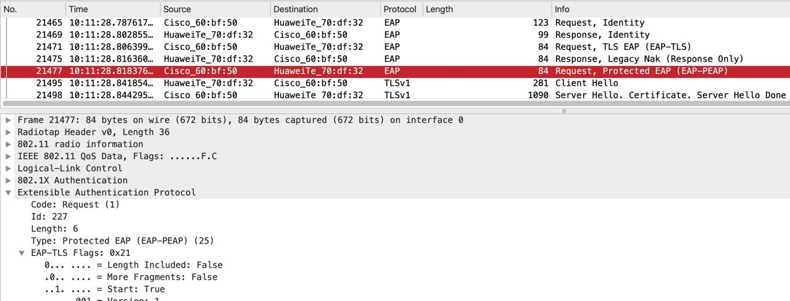
	
	- Phase d’initiation. Arrivez-vous à voir l’identité du client ?
	
	  Oui, comme on peut le constater (entouré en rouge), l'identité est **einet\joel.gonin** 
	
	  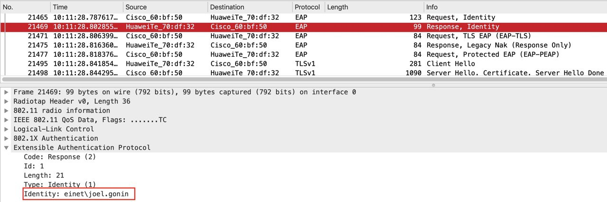
	
	- Phase hello :
		
		**Client**
		
		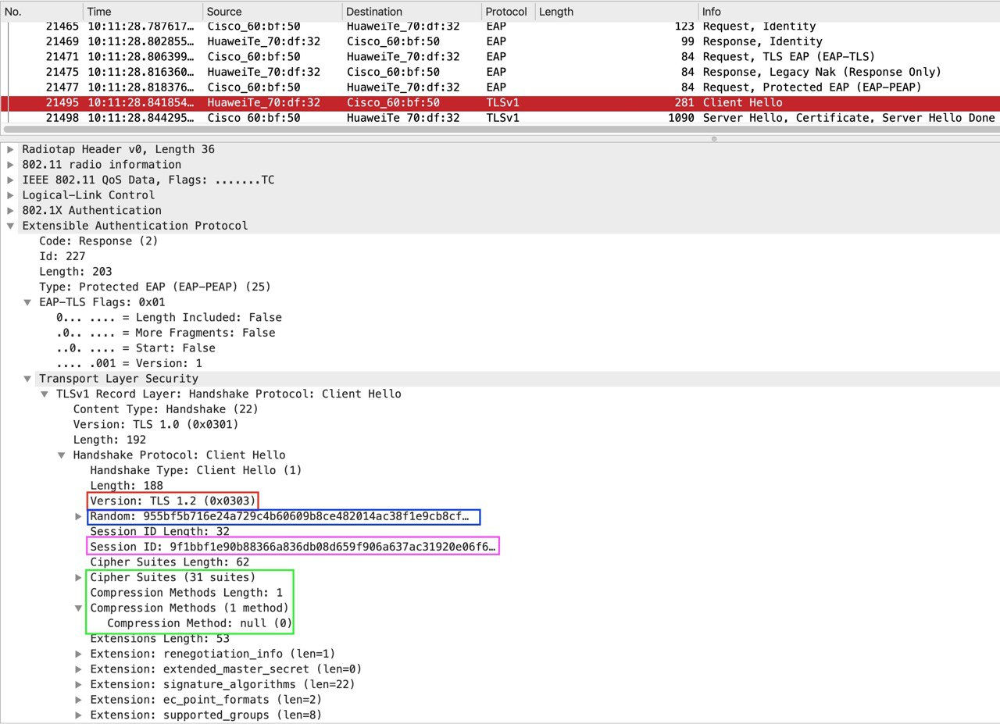
		
		**Serveur**
		
		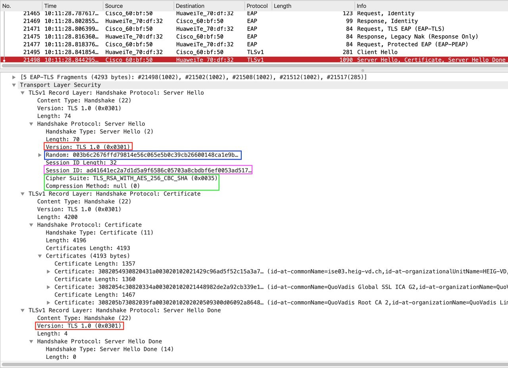
		
		- Version TLS
		
		  Comme on peut le constater sur les captures ci-dessus(entourés en rouges), la version TLS que le client demande est le 1.2 tandis que le serveur lui indique que ce sera la 1.0 pour les futures échanges.
		
		- Suites cryptographiques et méthodes de compression proposées par le client et acceptées par l’AP
		
		  Comme on peut le voir sur la capture en dessus (entouré en vert) dont la version détaillée se trouve ci-dessous, le client propose 31 suites cryptographiques et comme on peut le voir sur la capture d'écran du serveur (entouré en vert) ci-dessus, la méthode choisie chez le client est **TLS_RSA_WITH_AES_256_CBC_SHA (0x0035)**.
		
		  Par ailleurs, nous pouvons voir qu'il n'y a pas de méthode de compression qui a été proposée/choisie et donc, ce champ est mis à null.
		
		  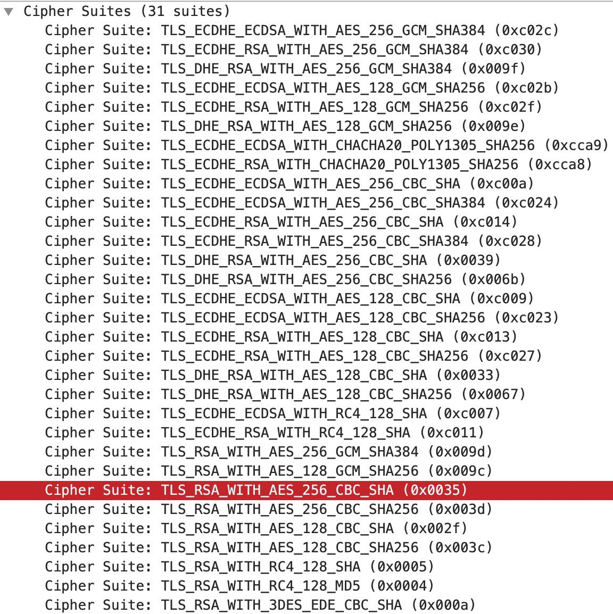
		
		- Nonces
		
		  Comme nous pouvons le constater sur les deux captures "Client" et "Serveur" plus haut, en encadrés bleus, le champ "random" correspond au nonce de chacun.
		
		- Session ID
		
		  Comme nous pouvons le constater sur les deux captures "Client" et "Serveur" plus haut, en encadrés roses/violets, le champ "session ID" correspond à la session ID de chacun.
		
	- Phase de transmission de certificats
	
	   	- Echanges des certificats
	    	
	    	Ci-dessous, les 3 certificats envoyés par le serveur
	  	
	  	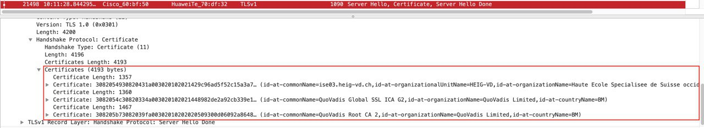
	  	
	  - Change cipher spec
	
	    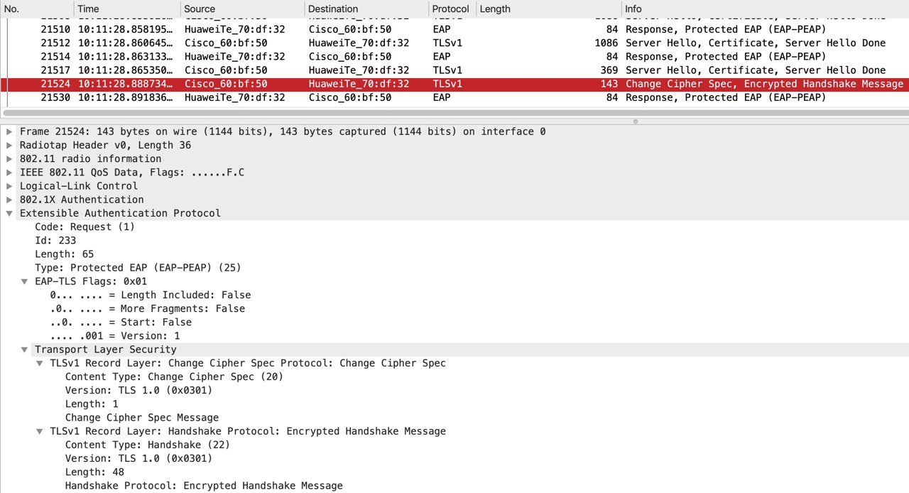
	
	- Authentification interne et transmission de la clé WPA (échange chiffré, vu comme « Application data »)
	
	  Comme vu dans la théorie, les "Application Data" ci-dessous correspondent bien aux paquets permettant l'authentification interne. 
	
	  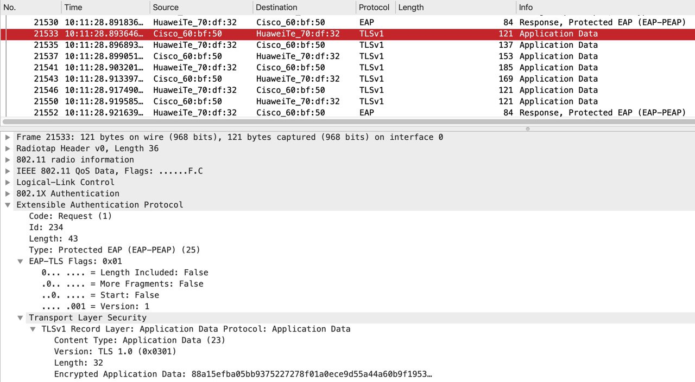
	
	- 4-way handshake
	
	  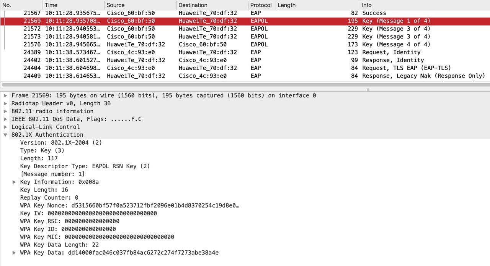

### Répondez aux questions suivantes :

> **_Question :_** Quelle ou quelles méthode(s) d’authentification est/sont proposé(s) au client ?
> 
> **_Réponse :_**  comme nous pouvons le constater au point "négociation de la méthode d'authentification entreprise", la méthode qui est proposée au client est EAP-TLS. Le client refuse et propose EAP-PEAP.  

---

> **_Question:_** Quelle méthode d’authentification est finalement utilisée ?
> 
> **_Réponse:_** comme mentionné précédemment, au final, EAP-PEAP est utilisée.

---

> **_Question:_** Lors de l’échange de certificats entre le serveur d’authentification et le client :
>
> - a. Le serveur envoie-t-il un certificat au client ? Pourquoi oui ou non ?
>
> **_Réponse:_**
>
> Oui, le serveur en envoie 3. Cela permet à ce dernier de prouver son identité auprès du client et ainsi éviter des attaques du type Man In The Middle.
>
> - b. Le client envoie-t-il un certificat au serveur ? Pourquoi oui ou non ?
>
> **_Réponse:_**
>
> Non, car la méthode d'authentification utilisée est EAP-PEAP et ce dernier ne nécessite pas l'envoie d'un certificat par le client pour s'authentifier mais via des identifiants contrairement à EAP-TLS.  

---

## Livrables

Un fork du repo original . Puis, un Pull Request contenant :

-	Captures d’écran + commentaires
-	Réponses aux questions

## Échéance

Le 1 juin 2020 à 23h59